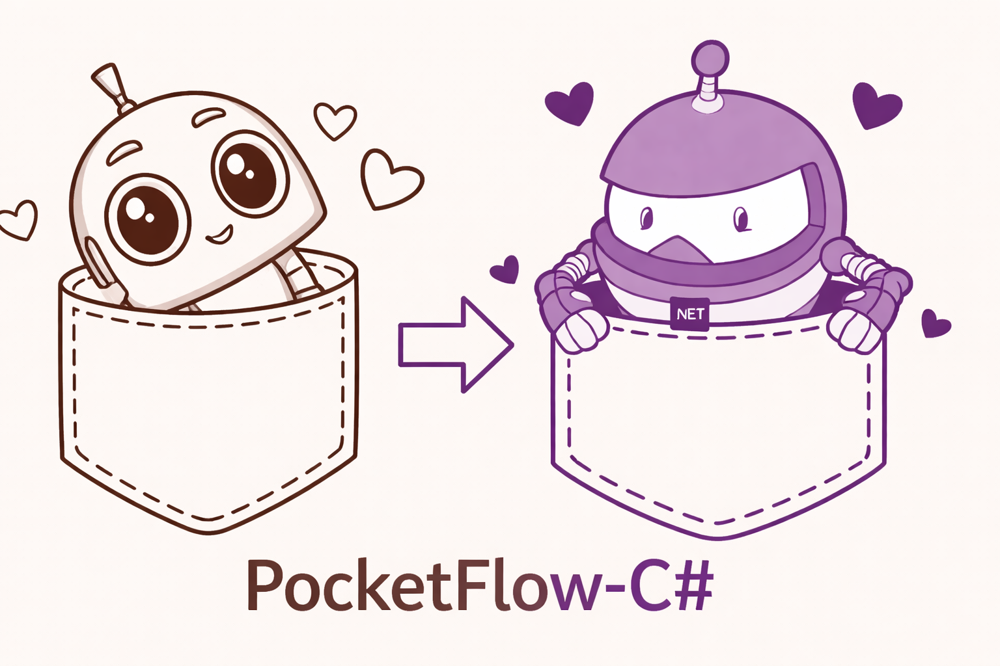

<div align="center">
  
</div>


[](https://the-pocket.github.io/PocketFlow/)
<a href="https://discord.gg/hUHHE9Sa6T">
    
</a>

> **C# / .NET port** of the [Pocket Flow](https://github.com/k0zi/PocketFlow-Csharp/docs/images/pocketflow-csharp.png) minimalist LLM framework.

Pocket Flow is a [~350-line](src/PocketFlow/) minimalist LLM framework for C#/.NET

- **Lightweight**: ~350 lines. Zero bloat, zero vendor lock-in.

- **Expressive**: Everything you love—([Multi-](https://the-pocket.github.io/PocketFlow/design_pattern/multi_agent.html))[Agents](https://the-pocket.github.io/PocketFlow/design_pattern/agent.html), [Workflow](https://the-pocket.github.io/PocketFlow/design_pattern/workflow.html), [RAG](https://the-pocket.github.io/PocketFlow/design_pattern/rag.html), and more.

- **[Agentic Coding](https://zacharyhuang.substack.com/p/agentic-coding-the-most-fun-way-to)**: Let AI Agents (e.g., Cursor AI) build Agents—10x productivity boost!

Get started with Pocket Flow for C#:
- Copy the [source code](src/PocketFlow/) directly into your project (only ~350 lines), or reference it as a project dependency.
- To learn more, check out the [documentation](https://the-pocket.github.io/PocketFlow/)
- 🎉 Join the [Discord](https://discord.gg/hUHHE9Sa6T) to connect with other developers building with Pocket Flow!
- 🎉 Pocket Flow also has [Python](https://github.com/The-Pocket/PocketFlow), [TypeScript](https://github.com/The-Pocket/PocketFlow-Typescript), [Java](https://github.com/The-Pocket/PocketFlow-Java), [C++](https://github.com/The-Pocket/PocketFlow-CPP), [Go](https://github.com/The-Pocket/PocketFlow-Go), [Rust](https://github.com/The-Pocket/PocketFlow-Rust) and [PHP](https://github.com/The-Pocket/PocketFlow-PHP) versions!

## Prerequisites

- [.NET 10 SDK](https://dotnet.microsoft.com/download)
- [Ollama](https://ollama.com) running locally (most examples use `gemma3:latest` or `llama3.2`)

## Quick Start

```bash
# Clone the repository
git clone https://github.com/The-Pocket/PocketFlow.git
cd PocketFlow

# Build the whole solution
dotnet build src/PocketFlow.sln

# Run the Hello World example
cd src/HelloWorld
dotnet run
```

## Why Pocket Flow?

Current LLM frameworks are bloated... You only need ~350 lines for an LLM Framework!
Lightweight, flexible with graph abstractions.

## How does Pocket Flow work?

The [~350 lines](src/PocketFlow/) capture the core abstraction of LLM frameworks: Graph!
<br>
<div align="center">
  
</div>
<br>

From there, it's easy to implement popular design patterns like ([Multi-](https://the-pocket.github.io/PocketFlow/design_pattern/multi_agent.html))[Agents](https://the-pocket.github.io/PocketFlow/design_pattern/agent.html), [Workflow](https://the-pocket.github.io/PocketFlow/design_pattern/workflow.html), [RAG](https://the-pocket.github.io/PocketFlow/design_pattern/rag.html), etc.
<br>
<div align="center">
  
</div>
<br>
✨ Below are C# example projects included in this solution:

<div align="center">

|  Name  | Difficulty    |  Description  |
| :-------------:  | :-------------: | :--------------------- |
| [Hello World](src/HelloWorld) | ☆☆☆ <sup>*Dummy*</sup> | Your first PocketFlow app — minimal Q&A with Ollama |
| [Chat](src/Chat) | ☆☆☆ <sup>*Dummy*</sup>  | A basic chat bot with conversation history |
| [Flow](src/Flow) | ☆☆☆ <sup>*Dummy*</sup> | Interactive text transformation with conditional transitions |
| [Workflow](src/Workflow) | ☆☆☆ <sup>*Dummy*</sup> | An article-writing workflow: outline → write → style |
| [Agent](src/Agent) | ☆☆☆ <sup>*Dummy*</sup>  | A research agent that searches the web and answers questions |
| [RAG](src/Rag) | ☆☆☆ <sup>*Dummy*</sup> | A simple Retrieval-Augmented Generation pipeline |
| [Batch](src/Batch) | ☆☆☆ <sup>*Dummy*</sup> | A batch processor that translates markdown into multiple languages |
| [Streaming](src/LlmStreaming) | ☆☆☆ <sup>*Dummy*</sup> | Real-time LLM streaming with user interrupt capability |
| [Chat Guardrail](src/Guardrail) | ☆☆☆ <sup>*Dummy*</sup> | A travel advisor chatbot that only processes travel-related queries |
| [Async Basic](src/AsyncBasic) | ☆☆☆ <sup>*Dummy*</sup> | Async HITL recipe finder demonstrating `AsyncNode` and `AsyncFlow` |
| [Multi-Agent](src/MultiAgent) | ★☆☆ <sup>*Beginner*</sup> | A Taboo word game with async communication between 2 agents |
| [Parallel](src/Parallel) | ★☆☆ <sup>*Beginner*</sup> | Parallel batch translation showing concurrent speedup |
| [Parallel Flow](src/ParallelFlow) | ★☆☆ <sup>*Beginner*</sup> | Parallel image processing with `AsyncParallelBatchFlow` |
| [Thinking](src/Thinking) | ★☆☆ <sup>*Beginner*</sup> | Solve complex reasoning problems through Chain-of-Thought |
| [Memory](src/Memory) | ★☆☆ <sup>*Beginner*</sup> | A chat bot with short-term and long-term memory |
| [Text2SQL](src/Text2Sql) | ★☆☆ <sup>*Beginner*</sup> | Convert natural language to SQL with an auto-debug loop |
| [Code Generator](src/CodeGenerator) | ★☆☆ <sup>*Beginner*</sup> | Generate test cases, implement solutions, and iteratively improve code |
| [MCP](src/MCP) | ★☆☆ <sup>*Beginner*</sup> | Agent using Model Context Protocol for numerical operations |
| [Agent Skills](src/AgentSkills) | ★☆☆ <sup>*Beginner*</sup> | Route requests to reusable markdown skills in an agent flow |
| [A2A](src/A2a) | ★☆☆ <sup>*Beginner*</sup> | Agent wrapped with the A2A protocol for inter-agent communication |
| [Voice Chat](src/VoiceChat) | ★☆☆ <sup>*Beginner*</sup> | Interactive voice chat with VAD, STT, LLM, and TTS |
| [BatchNode](src/BatchNode) | ★☆☆ <sup>*Beginner*</sup> | CSV chunk processing demonstrating `BatchNode` |
| [BatchFlow](src/BatchFlow) | ★☆☆ <sup>*Beginner*</sup> | Apply multiple image filters via `BatchFlow` |
| [Embedding Tool](src/EmbeddingTool) | ★☆☆ <sup>*Beginner*</sup> | Generate text embeddings with a local Ollama model |
| [Search Tool](src/SearchTool) | ★☆☆ <sup>*Beginner*</sup> | DuckDuckGo web search with LLM-powered summarisation |
| [Crawler Tool](src/CrawlerTool) | ★★☆ <sup>*Medium*</sup> | Web crawler with LLM content analysis and report generation |
| [PDF Vision](src/PdfVision) | ★★☆ <sup>*Medium*</sup> | PDF OCR using OpenAI GPT-4o Vision API |
| [Codebase Knowledge Builder](src/CodebaseKnowledgeBuilder) | ★★☆ <sup>*Medium*</sup> | Turn any GitHub repo into a beginner-friendly tutorial |
| [Visualization](src/Visualization) | ★★☆ <sup>*Medium*</sup> | Interactive D3.js flow-graph visualizer for PocketFlow pipelines |

</div>

👀 Want to see other tutorials for dummies? [Create an issue!](https://github.com/The-Pocket/PocketFlow/issues/new)

## How to Use Pocket Flow?

🚀 Through **Agentic Coding**—the fastest LLM App development paradigm—where *humans design* and *agents code*!

<br>
<div align="center">
  <a href="https://zacharyhuang.substack.com/p/agentic-coding-the-most-fun-way-to" target="_blank">
    
  </a>
</div>
<br>

- Want to learn **Agentic Coding**?

  - Check out [my YouTube](https://www.youtube.com/@ZacharyLLM?sub_confirmation=1) for video tutorials on how apps are built!

  - Want to build your own LLM App? Read this [post](https://zacharyhuang.substack.com/p/agentic-coding-the-most-fun-way-to)!
