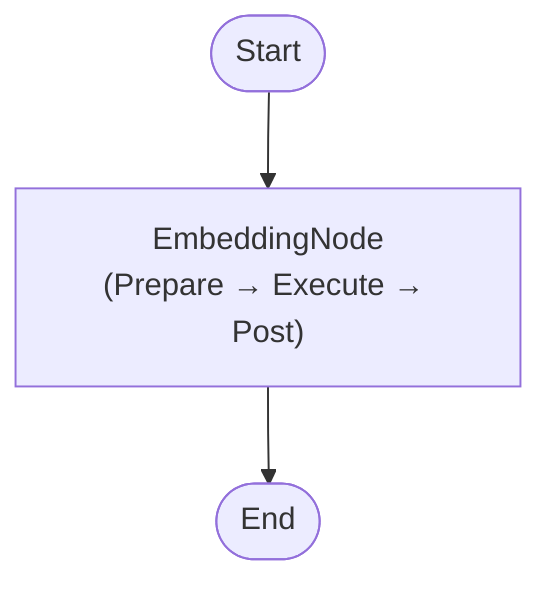

# EmbeddingTool (C#)

Demonstrates how to generate text embeddings with **PocketFlow** for C#, backed by a local embedding model via [OllamaSharp](https://github.com/awaescher/OllamaSharp).

> C# port of the Python cookbook at `cookbook/pocketflow-tool-embeddings`.

---

## How It Works

A single-node flow reads a text string from the shared store, calls the local embedding model through `OllamaConnector.GetEmbedding` (provided by **SharedUtils**), and stores the resulting `float[]` vector back in the shared store.



### Node reference

| Node | Responsibility |
|---|---|
| `EmbeddingNode` | Reads `shared["text"]`, calls `OllamaConnector.GetEmbedding`, writes `shared["embedding"]` |

---

## Project Structure

```
EmbeddingTool/
├── EmbeddingNode.cs        # PocketFlow node — wraps OllamaConnector.GetEmbedding
├── EmbeddingFlow.cs        # Flow factory — wires EmbeddingNode into a Flow
├── Program.cs              # Entry point — runs the flow and prints results
├── EmbeddingTool.csproj    # Project file (references PocketFlow + SharedUtils)
└── README.md
```

## Dependencies

| Project | Purpose |
|---------|---------|
| `PocketFlow` | Core `Node` / `Flow` primitives |
| `SharedUtils` | `OllamaConnector.GetEmbedding` — wraps the Ollama embeddings HTTP API |

Embedding generation is provided by **SharedUtils** (`OllamaConnector.GetEmbedding`), which is shared across all examples in this solution. No duplication needed.

---

## Prerequisites

- [.NET 10 SDK](https://dotnet.microsoft.com/download)
- [Ollama](https://ollama.com) running locally on `http://localhost:11434`
- An embedding model pulled, e.g.:
  ```bash
  ollama pull nomic-embed-text
  ```

---

## Running

```bash
cd src/EmbeddingTool
dotnet run
```

Expected output:

```
Text:               What's the meaning of life?
Embedding dimension:768
First 5 values:     [0.012345, -0.023456, ...]
```

---

## Configuration

| Environment variable | Default | Description |
|---|---|---|
| `OLLAMA_HOST` | `http://localhost:11434` | Ollama server URL |
| `OLLAMA_EMBED_MODEL` | `embeddinggemma` | Embedding model to use |

---

## What This Example Demonstrates

- How to integrate an embedding model into a PocketFlow application in C#
- The three-phase **Prepare → Execute → Post** Node lifecycle
- Sharing state between nodes via the `shared` dictionary
- Reusing `OllamaConnector` from **SharedUtils** instead of duplicating LLM/embedding utility code

---

## Additional Resources

- [PocketFlow Documentation](https://the-pocket.github.io/PocketFlow/)
- [OllamaSharp on GitHub](https://github.com/awaescher/OllamaSharp)

