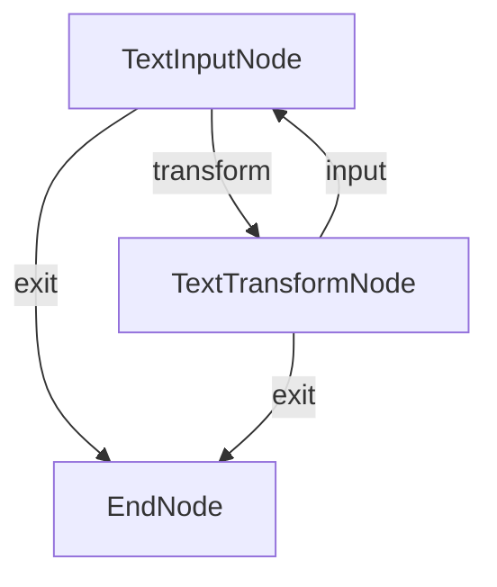

# Text Converter Flow

Interactive text transformation tool built with PocketFlow (C# port of `pocketflow-flow`).

## Features

- Convert text to **UPPERCASE**
- Convert text to **lowercase**
- **Reverse** text
- Remove **extra spaces**
- Interactive command-line interface with continuous loop

## Getting Started

```bash
dotnet run --project src/Flow
```

## How It Works

The workflow features an interactive loop with branching paths:



| Node | Responsibility |
|------|----------------|
| `TextInputNode` | Reads the text from the user and displays the transformation menu |
| `TextTransformNode` | Applies the chosen transformation and asks whether to continue |
| `EndNode` | Terminal node — reached when the user opts to exit |

## Example Output

```
Welcome to Text Converter!
=========================

Enter text to convert: PocketFlow is a 100-line LLM framework

Choose transformation:
1. Convert to UPPERCASE
2. Convert to lowercase
3. Reverse text
4. Remove extra spaces
5. Exit

Your choice (1-5): 1

Result: POCKETFLOW IS A 100-LINE LLM FRAMEWORK

Convert another text? (y/n): n

Thank you for using Text Converter!
```

## Files

| File | Description |
|------|-------------|
| `Program.cs` | Entry point — wires nodes together and runs the flow |
| `TextInputNode.cs` | `Prepare` reads text; `Post` presents the menu and returns an action |
| `TextTransformNode.cs` | `Execute` applies the transformation; `Post` shows the result and loops or exits |
| `EndNode.cs` | Empty terminal node reached on "exit" action |
| `Flow.csproj` | Project file referencing `PocketFlow` and `SharedUtils` |

## Project References

- **PocketFlow** — core `Node` / `Flow` primitives
- **SharedUtils** — shared console and LLM utilities (`OllamaConnector`, `ConsoleUtils`, …)

