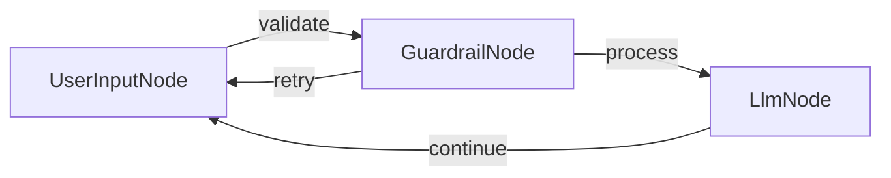

# Travel Advisor Chat with Guardrails

A travel-focused chat application built with **PocketFlow** (C#), featuring input validation to ensure only travel-related queries reach the LLM.

## Features

- Travel advisor chatbot that answers questions about destinations, planning, accommodations, and more.
- **Topic-specific guardrails** — an LLM-backed validator rejects non-travel queries before they are processed.
- Conversation history maintained across turns.
- Graceful exit via the `exit` command.

## How It Works



| Node | Responsibility |
|------|---------------|
| `UserInputNode` | Reads user input from the console; routes to `validate` or exits. |
| `GuardrailNode` | Applies basic length checks then calls the LLM with a YAML-structured prompt to decide whether the query is travel-related. Routes to `retry` (invalid) or `process` (valid). |
| `LlmNode` | Forwards the full conversation history (with a travel-advisor system prompt) to the LLM and prints the reply. Routes back to `continue` to loop. |

### LLM & Utils

All LLM calls are made through **`OllamaConnector`** in the shared `SharedUtils` project.  
Configure the target model and host via environment variables:

| Variable | Default |
|---|---|
| `OLLAMA_HOST` | `http://localhost:11434` |
| `OLLAMA_MODEL` | `gemma3:latest` |

## Run It

1. Make sure [Ollama](https://ollama.com) is running and the desired model is pulled:
   ```bash
   ollama pull gemma3
   ```

2. From the repository root:
   ```bash
   cd src
   dotnet run --project Guardrail
   ```

## Example Output

```
Welcome to the Travel Advisor Chat! Type 'exit' to end the conversation.

You: Plan my trip to Thailand

Travel Advisor: Thailand offers a blend of vibrant cities, serene beaches, and rich
culture. Begin in Bangkok to explore the Grand Palace and local markets. Head north
to Chiang Mai for temples and elephant sanctuaries. Fly south to the islands; Phuket
or Koh Samui for beaches, diving, and nightlife. Consider visiting during the cool
season (November–February) for pleasant weather. Don't miss local cuisine — from
street food to fine dining. Ensure your passport is valid for six months and consider
travel insurance for peace of mind. Enjoy!

You: How do I study large language models?

Travel Advisor: That question isn't related to travel. Please ask about destinations,
trip planning, accommodations, transport, or other travel topics.

You: exit

Goodbye! Safe travels!
```

## Files

| File | Description |
|------|-------------|
| `Program.cs` | Wires nodes together and starts the flow. |
| `UserInputNode.cs` | Reads console input; exits or routes to guardrail. |
| `GuardrailNode.cs` | Validates travel relevance via heuristics + LLM (YAML response). |
| `LlmNode.cs` | Calls the LLM with conversation history; appends reply. |
| `Guardrail.csproj` | Project file — references `PocketFlow`, `SharedUtils`, and `YamlDotNet`. |

