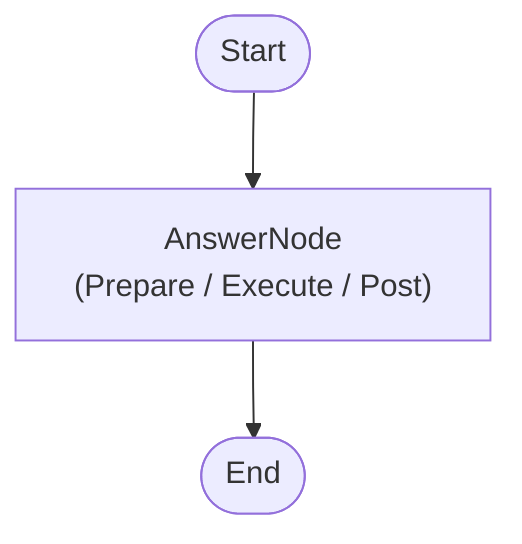

# PocketFlow Hello World (C#)

Your first PocketFlow application in C#. Demonstrates how to build a minimal question-answering flow backed by a local LLM via [OllamaSharp](https://github.com/awaescher/OllamaSharp).

## Project Structure

```
HelloWorld/
├── AnswerNode.cs      # Single node – reads question, calls LLM, writes answer
├── Program.cs         # Entry point – wires the flow and prints the result
├── HelloWorld.csproj  # Project file (references PocketFlow + SharedUtils)
├── docs/
│   └── design.md      # Architecture / design notes
└── README.md
```

## Dependencies

| Project | Purpose |
|---------|---------|
| `PocketFlow` | Core `Node` / `Flow` primitives |
| `SharedUtils` | `OllamaConnector.CallLlm` – wraps the Ollama HTTP API |

`call_llm` is provided by **SharedUtils** (`OllamaConnector.CallLlm`), which is shared across all examples in this solution. No duplication needed.

## Prerequisites

- [.NET 10 SDK](https://dotnet.microsoft.com/download)
- [Ollama](https://ollama.com) running locally on `http://localhost:11434`
- The model referenced by `OLLAMA_MODEL` env-var (default: `gemma3:latest`) pulled:
  ```bash
  ollama pull gemma3:latest
  ```

## Running

```bash
cd src/HelloWorld
dotnet run
```

Expected output:

```
Question: In one sentence, what's the end of universe?
Answer:   <LLM response>
```

## Configuration

| Environment variable | Default | Description |
|----------------------|---------|-------------|
| `OLLAMA_HOST`  | `http://localhost:11434` | Ollama server URL |
| `OLLAMA_MODEL` | `gemma3:latest`          | Chat model to use |

## What This Example Demonstrates

- How to create a minimal PocketFlow application in C#
- The three-phase **Prepare → Execute → Post** Node lifecycle
- Sharing state between nodes via the `shared` dictionary
- Reusing the `OllamaConnector` utility from `SharedUtils`

## Flow Diagram



## Additional Resources

- [PocketFlow Documentation](https://the-pocket.github.io/PocketFlow/)
- [OllamaSharp on GitHub](https://github.com/awaescher/OllamaSharp)

