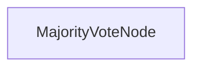

# Majority Vote Reasoning

A C# implementation of majority-vote reasoning that enables LLMs to solve complex problems by aggregating multiple independent attempts. Consensus-based aggregation improves accuracy on hard reasoning tasks.

## Features

- Improves model reliability on complex problems through multiple independent attempts
- Works with any model accessible via [OllamaConnector](../SharedUtils/OllamaConnector.cs) (default: `gemma3:latest`)
- Parses structured YAML responses and tallies votes across attempts
- Provides a consensus answer with frequency statistics
- CLI arguments to supply custom problems and attempt counts

## Getting Started

1. Make sure [Ollama](https://ollama.com) is running locally (default: `http://localhost:11434`).

2. Pull the default model (or set `OLLAMA_MODEL` to any model you prefer):
   ```bash
   ollama pull gemma3:latest
   ```

3. Build and run the project:
   ```bash
   dotnet run --project MajorityVote
   ```

4. Optionally pass a custom problem and number of attempts:
   ```bash
   dotnet run --project MajorityVote -- --problem "Your complex reasoning problem here" --tries 5
   ```

## How It Works

The flow consists of a single `MajorityVoteNode` (a `BatchNode`):



**`MajorityVoteNode`** (inherits `BatchNode`):
1. **Prepare** – duplicates the question `num_tries` times to form the batch.
2. **Execute** – sends each copy to the LLM, which responds with a structured YAML block containing `thinking` and `answer` fields. The `answer` is extracted and returned.
3. **ExecuteFallback** – returns `null` for any failed attempt so the vote continues.
4. **Post** – tallies all non-null answers, selects the majority, and stores it in `shared["majority_answer"]`.

## Environment Variables

| Variable | Default | Description |
|---|---|---|
| `OLLAMA_HOST` | `http://localhost:11434` | Ollama server URL |
| `OLLAMA_MODEL` | `gemma3:latest` | Chat model to use |

## Example Problem

From a [Quant Interview](https://www.youtube.com/watch?v=SCP7JptxPU0):

> You work at a shoe factory. There are three pairs of shoes (six individual shoes): two size 4s, two size 5s, and two size 6s. An "acceptable pair" differs by at most one size. If you randomly pick three pairs without replacement, what is the probability of drawing three acceptable pairs?

Example output with 5 attempts:

```
========================
All structured answers: ['0.333', '0.333', '0.333', '0.6', '0.333']
Majority vote => 0.333
Frequency => 4
========================

=== Final Answer ===
0.333
====================
```

## Files

| File | Description |
|---|---|
| [`MajorityVoteNode.cs`](./MajorityVoteNode.cs) | BatchNode that runs multiple LLM attempts and tallies votes |
| [`Program.cs`](./Program.cs) | Entry point with optional `--problem` / `--tries` CLI arguments |
| [`MajorityVote.csproj`](./MajorityVote.csproj) | Project file (references PocketFlow + SharedUtils) |

LLM utilities (model connectivity, embedding, etc.) are provided by the shared [`SharedUtils`](../SharedUtils) project via `OllamaConnector`.

