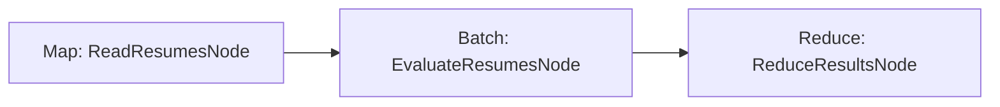

# Resume Qualification – Map Reduce

A PocketFlow example that demonstrates how to implement a **Map-Reduce** pattern to process and evaluate resumes using an LLM.

## Features

- Reads multiple resume files from the `data/` directory (Map phase)
- Evaluates each resume individually via a `BatchNode` with structured YAML output
- Determines if candidates qualify for technical roles based on defined criteria
- Aggregates per-resume results into a qualification summary (Reduce phase)
- LLM calls are provided by the shared **SharedUtils** project (`OllamaConnector`) — no local `utils.cs` copy needed

## Getting Started

1. Ensure [Ollama](https://ollama.com/) is running locally (default: `http://localhost:11434`) with a suitable model (default: `gemma3:latest`).

2. Build and run:
   ```bash
   dotnet run --project MapReduce
   ```

   Optional environment variables:
   | Variable | Default | Description |
   |---|---|---|
   | `OLLAMA_HOST` | `http://localhost:11434` | Ollama server URL |
   | `OLLAMA_MODEL` | `gemma3:latest` | Model to use for evaluation |

## How It Works



1. **ReadResumesNode** – Reads all `.txt` files from `data/` and stores them in the shared store as `resumes`.
2. **EvaluateResumesNode** – `BatchNode` that processes each resume individually: sends a structured prompt to the LLM and parses the YAML response into a `ResumeEvaluation` record.
3. **ReduceResultsNode** – Aggregates all `ResumeEvaluation` results and prints a qualification summary.

### Qualification criteria

- At least a bachelor's degree in a relevant field
- At least 3 years of relevant work experience
- Strong technical skills relevant to the position

## Project Structure

| File | Description |
|---|---|
| `Program.cs` | Entry point – builds and runs the flow; prints per-file results |
| `ReadResumesNode.cs` | Map phase – loads resume files from `data/` |
| `EvaluateResumesNode.cs` | Batch phase – evaluates each resume via LLM; parses YAML output |
| `ReduceResultsNode.cs` | Reduce phase – aggregates evaluations into a summary |
| `MapReduce.csproj` | Project file with references to **PocketFlow** and **SharedUtils** |
| `data/` | Sample resume `.txt` files |

LLM utilities (`OllamaConnector`) and YAML support (`YamlDotNet`) live in the shared **SharedUtils** project.

## Example Output

```
Starting resume qualification processing...
Loaded 5 resume(s) from data
Evaluated: resume1.txt → John Smith (Qualifies)
Evaluated: resume2.txt → Emily Johnson (Qualifies)
Evaluated: resume3.txt → Michael Williams (Does not qualify)
Evaluated: resume4.txt → Lisa Chen (Does not qualify)
Evaluated: resume5.txt → Robert Taylor (Does not qualify)

===== Resume Qualification Summary =====
Total candidates evaluated: 5
Qualified candidates: 2 (40%)

Qualified candidates:
- John Smith
- Emily Johnson

Detailed evaluation results:
✓ John Smith (resume1.txt)
✓ Emily Johnson (resume2.txt)
✗ Michael Williams (resume3.txt)
✗ Lisa Chen (resume4.txt)
✗ Robert Taylor (resume5.txt)

Resume processing complete!
```

