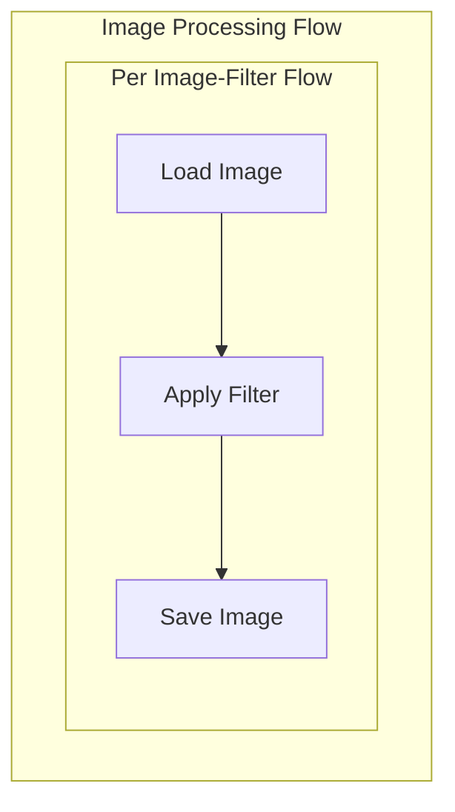

# Parallel Image Processor

Demonstrates how `AsyncParallelBatchFlow` processes multiple images with multiple filters
significantly faster than the sequential `AsyncBatchFlow`.

## Features



- Processes images with multiple filters in parallel
- Applies three different filters: **grayscale**, **blur**, **sepia**
- Shows a significant speed improvement over sequential processing
- Uses `SixLabors.ImageSharp` for cross-platform image manipulation

## Structure

| File | Description |
|------|-------------|
| `Program.cs` | Entry point – discovers images, runs both flows, reports timing |
| `Nodes.cs` | `LoadImage`, `ApplyFilter`, `SaveImage` async nodes |
| `Flow.cs` | `ImageBatchFlow` (sequential) and `ImageParallelBatchFlow` (parallel) |

## Run It

Place `.jpg` / `.jpeg` / `.png` images inside the `images/` directory, then:

```bash
cd src
dotnet run --project ParallelFlow
```

## Example Output

```
=== Processing Images in Parallel ===
Parallel Image Processor
------------------------------
Found 3 images:
- images/bird.jpg
- images/cat.jpg
- images/dog.jpg

Running sequential batch flow...
Processing 3 images with 3 filters...
Total combinations: 9
Loading image: images/bird.jpg
Applying grayscale filter...
Saved: output/bird_grayscale.jpg
...

Running parallel batch flow...
Processing 3 images with 3 filters...
Total combinations: 9
...

Timing Results:
Sequential batch processing: 13.51 seconds
Parallel batch processing:    1.72 seconds
Speedup: 7.86x

Processing complete! Check the output/ directory for results.
```

## Key Points

- **Sequential** (`AsyncBatchFlow`): Total time = sum of all item times
  - Good for: Rate-limited APIs, maintaining strict ordering

- **Parallel** (`AsyncParallelBatchFlow`): Total time ≈ longest single item time
  - Good for: I/O-bound tasks, fully independent operations

## Node Design

Each node stores intermediate results in the shared dictionary under a **unique key**
derived from the image filename and filter name (e.g. `image_bird_grayscale`).  
This prevents concurrent tasks from overwriting each other's data.

```csharp
private string TaskKey()
{
    var imagePath = (string)Params["image_path"];
    var filter    = (string)Params["filter"];
    return $"{Path.GetFileNameWithoutExtension(imagePath)}_{filter}";
}
```

