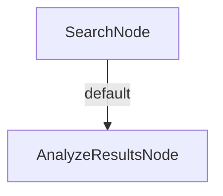

# Web Search Tool (C#)

A web search and analysis tool built with **PocketFlow** for C#. Performs a DuckDuckGo web search and uses an LLM to summarise the results, extract key points, and suggest follow-up queries.

> Ported from the Python cookbook at `cookbook/pocketflow-tool-search`.

---

## How It Works



| Node | Responsibility |
|---|---|
| `SearchNode` | Queries DuckDuckGo (top 5 results) via `WebSearchUtils` (SharedUtils) |
| `AnalyzeResultsNode` | Sends results to the LLM and parses a YAML response containing summary, key points, and follow-up queries |

Utilities are provided entirely by **SharedUtils**:

| SharedUtils member | Replaces |
|---|---|
| `WebSearchUtils.SearchWebDuckDuckGo` | `tools/search.py` (SerpAPI → DuckDuckGo) |
| `OllamaConnector.CallLlm` | `utils/call_llm.py` |

---

## Requirements

- [.NET 10 SDK](https://dotnet.microsoft.com/download)
- [Ollama](https://ollama.com/) running locally (or reachable via `OLLAMA_HOST`)

---

## Getting Started

### 1. Pull a model

```bash
ollama pull gemma3
```

### 2. Configure environment variables (optional)

| Variable | Default | Description |
|---|---|---|
| `OLLAMA_HOST` | `http://localhost:11434` | Ollama server URL |
| `OLLAMA_MODEL` | `gemma3:latest` | Model to use for all LLM calls |

```bash
export OLLAMA_HOST="http://localhost:11434"
export OLLAMA_MODEL="gemma3:latest"
```

### 3. Run interactively

```bash
dotnet run --project src/SearchTool
```

You will be prompted to enter a search query.

### 4. Pass a query directly

Prefix your query with `--`:

```bash
dotnet run --project src/SearchTool -- --"latest advances in quantum computing"
```

---

## Project Structure

| File | Description |
|---|---|
| `Program.cs` | Entry point – reads the query, wires nodes, runs the flow |
| `Nodes.cs` | `SearchNode` and `AnalyzeResultsNode` |
| `SearchTool.csproj` | Project file – references PocketFlow, SharedUtils, YamlDotNet |
| `README.md` | This file |

---

## Dependencies

| Package | Purpose |
|---|---|
| `PocketFlow` | Flow / Node orchestration |
| `SharedUtils` | `WebSearchUtils` (DuckDuckGo) + `OllamaConnector` (LLM) |
| `YamlDotNet` | Parsing LLM YAML responses |

