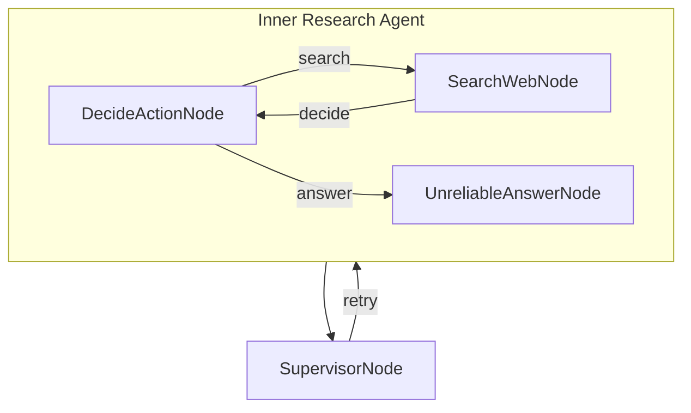

# Research Supervisor (C#)

A supervised LLM-powered research agent built with **PocketFlow** for C#. An outer supervisor node oversees an inner research agent that has a 50 % chance of producing unreliable answers, restarting the agent until a quality response is produced.

> Ported from the original Python cookbook at `cookbook/pocketflow-supervisor`.

---

## How It Works



| Node | Responsibility |
|---|---|
| `DecideActionNode` | Calls the LLM to decide whether to search the web or answer directly |
| `SearchWebNode` | Queries DuckDuckGo (top 5 results) and appends findings to shared context |
| `UnreliableAnswerNode` | Generates a final answer with a 50 % chance of returning nonsense |
| `SupervisorNode` | Validates the answer; returns `"retry"` to restart the inner flow if invalid |

---

## Requirements

- [.NET 10 SDK](https://dotnet.microsoft.com/download)
- [Ollama](https://ollama.com/) running locally (or reachable via `OLLAMA_HOST`)

---

## Getting Started

### 1. Pull a model

```bash
ollama pull gemma3
```

### 2. Configure environment variables (optional)

| Variable | Default | Description |
|---|---|---|
| `OLLAMA_HOST` | `http://localhost:11434` | Ollama server URL |
| `OLLAMA_MODEL` | `gemma3:latest` | Model to use for all LLM calls |

```bash
export OLLAMA_HOST="http://localhost:11434"
export OLLAMA_MODEL="gemma3:latest"
```

### 3. Run with the default question

```bash
dotnet run --project src/Supervisor
```

### 4. Ask your own question

Prefix your question with `--`:

```bash
dotnet run --project src/Supervisor -- --"What is quantum computing?"
```

---

## Example Output

```
🤔 Processing question: Who won the Nobel Prize in Physics 2024?
🤔 Agent deciding what to do next...
🔍 Agent decided to search for: Nobel Prize in Physics 2024 winner
🌐 Searching the web for: Nobel Prize in Physics 2024 winner
📚 Found information, analyzing results...
🤔 Agent deciding what to do next...
💡 Agent decided to answer the question
🤪 Generating unreliable dummy answer...
✅ Answer generated successfully
    🔍 Supervisor checking answer quality...
    ❌ Supervisor rejected answer: Answer appears to be nonsensical or unhelpful
🤔 Agent deciding what to do next...
💡 Agent decided to answer the question
✍️  Crafting final answer...
✅ Answer generated successfully
    🔍 Supervisor checking answer quality...
    ✅ Supervisor approved answer: Answer appears to be legitimate

🎯 Final Answer:
The Nobel Prize in Physics for 2024 was awarded jointly to John J. Hopfield and Geoffrey Hinton for
foundational discoveries and inventions that enable machine learning with artificial neural networks.
```

---

## Project Structure

| File | Description |
|---|---|
| `Program.cs` | Entry point — wires inner and outer flows, reads CLI args, runs the flow |
| `DecideActionNode.cs` | Calls the LLM to choose between searching and answering |
| `SearchWebNode.cs` | Queries DuckDuckGo and accumulates results in shared context |
| `UnreliableAnswerNode.cs` | Generates answers with a 50 % chance of producing nonsense |
| `SupervisorNode.cs` | Quality-control node that retries the inner flow on bad answers |
| `Supervisor.csproj` | Project file — references PocketFlow, SharedUtils, YamlDotNet |

---

## Dependencies

| Package | Purpose |
|---|---|
| `PocketFlow` | Graph-based flow orchestration |
| `SharedUtils` / `OllamaSharp` | Local LLM inference via Ollama and DuckDuckGo web search |
| `YamlDotNet` | Parse structured YAML responses from the LLM |

