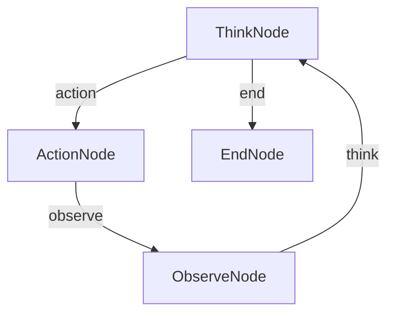

# ThoughtActionObservation (C#)

A C# implementation of the **Thought-Action-Observation (TAO)** loop pattern – a powerful technique that enables AI agents to solve complex problems through structured thinking, action execution, and result observation.

> Ported from the Python cookbook at `cookbook/pocketflow-tao`.
> LLM calls use `OllamaConnector` from the shared `SharedUtils` project.
> Web search uses `WebSearchUtils` (DuckDuckGo) from `SharedUtils`.

---

## How It Works



| Node | Responsibility |
|---|---|
| `ThinkNode` | Calls the LLM to decide the next action or produce the final answer |
| `ActionNode` | Executes the chosen action (`search`, `calculate`, or `answer`) |
| `ObserveNode` | Calls the LLM to generate an objective observation about the action result |
| `EndNode` | Terminal node; prints a completion message |

---

## Project Structure

```
ThoughtActionObservation/
├── Program.cs          # Entry point – builds and runs the TAO flow
├── ThinkNode.cs        # Decides next action via LLM + YAML parsing
├── ActionNode.cs       # Executes search / calculate / answer
├── ObserveNode.cs      # Summarises action results via LLM
├── EndNode.cs          # Terminal node
├── README.md
└── ThoughtActionObservation.csproj
```

Utility helpers (`OllamaConnector`, `WebSearchUtils`) live in the **SharedUtils** project and are shared across all cookbook examples.

---

## Requirements

- [.NET 10 SDK](https://dotnet.microsoft.com/download)
- [Ollama](https://ollama.com/) running locally (or reachable via `OLLAMA_HOST`)

---

## Getting Started

### 1. Pull a model

```bash
ollama pull gemma3
```

### 2. Configure environment variables (optional)

| Variable | Default | Description |
|---|---|---|
| `OLLAMA_HOST` | `http://localhost:11434` | Ollama server URL |
| `OLLAMA_MODEL` | `gemma3:latest` | Model used for all LLM calls |

```bash
export OLLAMA_HOST="http://localhost:11434"
export OLLAMA_MODEL="gemma3:latest"
```

### 3. Run

```bash
dotnet run --project ThoughtActionObservation
```

Pass a custom query:

```bash
dotnet run --project ThoughtActionObservation -- "What are the latest breakthroughs in quantum computing?"
```

---

## Example Output

```
🔎 Query: I need to understand the latest developments in artificial intelligence

🤔 Thought 1: Decided to execute 'search'
🚀 Executing action: 'search', input: latest developments artificial intelligence 2025
✅ Action completed, result obtained
👁️ Observation: The search returned multiple recent articles covering advances in large...
🤔 Thought 2: Decided to execute 'answer'
🎯 Final Answer: As of 2025, the most prominent AI developments include ...

── Final Answer ──────────────────────────────────────────────────────────────
As of 2025, the most prominent AI developments include ...

Flow ended, thank you for using!
```

---

## Advanced Usage

The TAO pattern can be extended by:

- **Adding memory** – persist thoughts/observations across sessions.
- **More tools** – add `code_interpreter`, `file_read`, `calculator` actions in `ActionNode`.
- **Iteration limit** – check `shared["current_thought_number"]` in `ThinkNode` to cap loops.
- **Human-in-the-loop** – prompt for user confirmation before executing sensitive actions.
- **Parallel actions** – fan-out multiple `ActionNode` variants with `BatchNode`.

---

## Additional Resources

- [PocketFlow Documentation](https://the-pocket.github.io/PocketFlow/)
- [Understanding AI Agents through the TAO Cycle](https://huggingface.co/learn/agents-course/en/unit1/agent-steps-and-structure)

