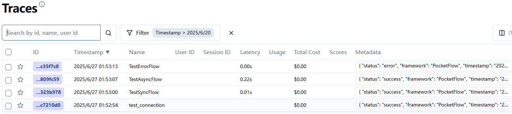
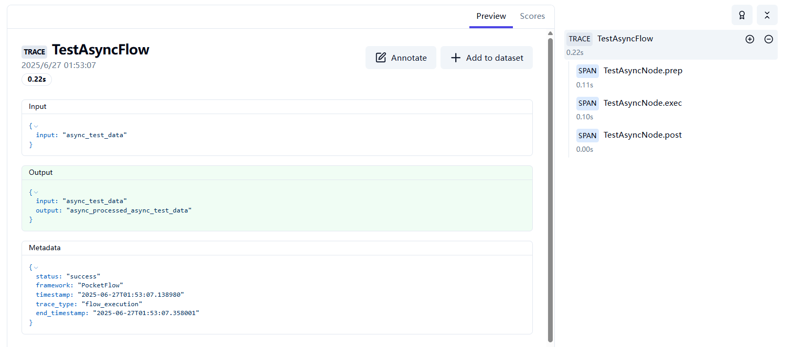

# PocketFlow Tracing with Langfuse

Automatic observability for PocketFlow workflows using [Langfuse](https://langfuse.com/) as the tracing backend.  
Ported from the Python `pocketflow-tracing` cookbook to idiomatic C#.

---

## 🎯 Features

- **Flow-level tracing** – records overall execution time, input/output state, and final status
- **Node-level spans** – one Langfuse span per node execution in the flow
- **Error tracking** – unhandled exceptions are captured and sent with `level: ERROR`
- **Async support** – full support for `TracedAsyncFlow` / `AsyncNode`
- **Minimal boilerplate** – inherit from `TracedFlow` or `TracedAsyncFlow` instead of `Flow` / `AsyncFlow`
- **No-op when unconfigured** – if Langfuse credentials are absent the flow still runs normally

---

## 🚀 Quick Start

### 1. Set Environment Variables

```env
LANGFUSE_SECRET_KEY=sk-lf-...
LANGFUSE_PUBLIC_KEY=pk-lf-...
LANGFUSE_HOST=https://your-langfuse-host
```

### 2. Basic Usage

```csharp
using PocketFlow;
using Tracing;

// ── Nodes ──────────────────────────────────────────────────────────────────

public class GreetingNode : Node
{
    protected override object? Prepare(object shared)
        => ((Dictionary<string, object>)shared).GetValueOrDefault("name", "World");

    protected override object? Execute(object? prepRes)
        => $"Hello, {prepRes}!";

    protected override object? Post(object shared, object? prepRes, object? execRes)
    {
        ((Dictionary<string, object>)shared)["greeting"] = execRes!;
        return "default";
    }
}

// ── Flow ───────────────────────────────────────────────────────────────────
// Inherit TracedFlow instead of Flow — that's all you need.

public class MyFlow : TracedFlow
{
    public MyFlow(TracingConfig? config = null)
        : base(flowName: "MyFlow", config: config)
    {
        StartNode = new GreetingNode();
    }
}

// ── Run ────────────────────────────────────────────────────────────────────

var flow   = new MyFlow();
var shared = new Dictionary<string, object> { ["name"] = "World" };
flow.Run(shared);
// → Langfuse receives one trace + one span
```

### 3. Async Usage

```csharp
using PocketFlow;
using Tracing;

public class FetchNode : AsyncNode
{
    protected override async Task<object?> ExecAsync(object? prepRes)
    {
        await Task.Delay(200); // simulate I/O
        return "fetched result";
    }

    protected override Task<object?> PostAsync(object shared, object? p, object? exec)
    {
        ((Dictionary<string, object>)shared)["result"] = exec!;
        return Task.FromResult<object?>("default");
    }
}

public class MyAsyncFlow : TracedAsyncFlow
{
    public MyAsyncFlow(TracingConfig? cfg = null)
        : base(flowName: "MyAsyncFlow", config: cfg)
    {
        StartNode = new FetchNode();
    }
}

// Run
var flow   = new MyAsyncFlow();
var shared = new Dictionary<string, object>();
await flow.RunAsync(shared);
```

---

## 📁 Project Structure

```
Tracing/
├── TracingConfig.cs         # Env-var based configuration (↔ tracing/config.py)
├── LangfuseTracer.cs        # HTTP REST tracer for Langfuse v2 API (↔ tracing/core.py)
├── TracedFlow.cs            # Sync base class with automatic tracing (↔ tracing/decorator.py)
├── TracedAsyncFlow.cs       # Async base class with automatic tracing
├── examples/
│   ├── BasicExample.cs      # Sync greeting flow demo (↔ examples/basic_example.py)
│   └── AsyncExample.cs      # Async fetch+process demo (↔ examples/async_example.py)
└── Program.cs               # Entry point — runs both examples
```

`SharedUtils/TracingSetupUtils.cs` contains setup validation helpers  
(consolidated from `utils/setup.py`).

---

## 🔧 Configuration

`TracingConfig.FromEnv()` reads all settings from environment variables:

| Variable | Default | Description |
|---|---|---|
| `LANGFUSE_SECRET_KEY` | *(required)* | Langfuse secret key |
| `LANGFUSE_PUBLIC_KEY` | *(required)* | Langfuse public key |
| `LANGFUSE_HOST` | *(required)* | Langfuse server URL |
| `POCKETFLOW_TRACING_DEBUG` | `false` | Print debug output |
| `POCKETFLOW_TRACE_INPUTS` | `true` | Record span inputs |
| `POCKETFLOW_TRACE_OUTPUTS` | `true` | Record span outputs |
| `POCKETFLOW_TRACE_PREP` | `true` | Trace prep phase |
| `POCKETFLOW_TRACE_EXEC` | `true` | Trace exec phase |
| `POCKETFLOW_TRACE_POST` | `true` | Trace post phase |
| `POCKETFLOW_TRACE_ERRORS` | `true` | Record exception details |
| `POCKETFLOW_SESSION_ID` | *(none)* | Session ID for grouping |
| `POCKETFLOW_USER_ID` | *(none)* | User ID for attribution |

Or construct `TracingConfig` manually:

```csharp
var config = new TracingConfig
{
    LangfuseSecretKey = "sk-lf-...",
    LangfusePublicKey = "pk-lf-...",
    LangfuseHost      = "https://cloud.langfuse.com",
    Debug             = true,
};
```

---

## 📊 What Gets Traced

| Level | What is captured |
|---|---|
| **Flow** | start time, input state, end time, output state, status (`success`/`error`) |
| **Node** | one span per `InternalRun` call: node type name, action returned, errors |

> **Node-phase granularity:** The Python version traced individual `prep`, `exec`, and `post` phases via runtime method patching. The C# port traces at the *node* level (one span per node run). This is consistent with C#'s static type system and gives the same high-level observability.

---

## 🔍 Viewing Traces

After running your flows, visit your Langfuse dashboard:

- **Traces** – one per flow execution  
- **Spans** – one per node in the flow  
- **Input/Output** – data returned by each node  
- **Errors** – stack trace and message for failed nodes

The tracings in examples.  


Detailed span view.  


---

## 🛠️ How It Works

`TracedFlow` extends `Flow` and overrides the tracing hooks added to the PocketFlow core:

```
Flow
├── OnFlowStarting(shared)        ← TracedFlow calls _tracer.StartTrace(...)
├── _Orch(shared)
│   ├── OnBeforeNodeRun(node, shared)  ← TracedFlow calls _tracer.StartNodeSpan(...)
│   ├── node.InternalRun(shared)
│   ├── OnAfterNodeRun(node, shared, action)  ← TracedFlow calls _tracer.EndNodeSpan(...)
│   └── OnNodeError(node, shared, ex)         ← TracedFlow calls _tracer.EndNodeSpan(error)
└── OnFlowCompleted / OnFlowError ← TracedFlow calls _tracer.EndTrace(...) + Flush()
```

`LangfuseTracer` batches events in memory and sends them via the  
`POST /api/public/ingestion` REST endpoint on `Flush()`.

---

## 🐛 Troubleshooting

| Issue | Fix |
|---|---|
| No traces in dashboard | Set `POCKETFLOW_TRACING_DEBUG=true` to see detailed logs |
| `✗ Langfuse not available or configuration invalid` | Check all three required env vars are set |
| `✗ Langfuse API error 401` | Verify public/secret key order and validity |
| `✗ FlushAsync failed` | Check network connectivity to `LANGFUSE_HOST` |

Enable debug mode:

```env
POCKETFLOW_TRACING_DEBUG=true
```

---

## 📚 API Reference

### `TracedFlow` (abstract)

Inherit instead of `Flow` for synchronous flows.

| Constructor parameter | Description |
|---|---|
| `start` | Optional start node (can also set `StartNode` in constructor body) |
| `flowName` | Display name in Langfuse. Defaults to the class name. |
| `config` | `TracingConfig` instance. Defaults to `TracingConfig.FromEnv()`. |

### `TracedAsyncFlow` (abstract)

Inherit instead of `AsyncFlow` for async flows. Same constructor parameters as `TracedFlow`.

### `TracingConfig`

| Method | Description |
|---|---|
| `TracingConfig.FromEnv()` | Create from environment variables |
| `Validate()` | Returns `true` when all required fields are set |
| `ToLangfuseArgs()` | Returns a `Dictionary<string,string>` of Langfuse init kwargs |

### `LangfuseTracer`

| Method | Description |
|---|---|
| `StartTrace(name, input)` | Begin a new trace; returns trace ID |
| `EndTrace(output, status)` | Finalise the current trace |
| `StartNodeSpan(name, id, phase)` | Open a span; returns span key |
| `EndNodeSpan(key, input, output, error)` | Close a span |
| `Flush()` / `FlushAsync()` | Send all queued events to Langfuse |

### `TracingSetupUtils` *(in SharedUtils)*

| Method | Description |
|---|---|
| `ValidateTracingEnvironment()` | Check env vars; prints missing ones |
| `PrintConfigurationHelp()` | Print setup instructions to the console |

---

## 📄 License

Follows the same licence as PocketFlow.

