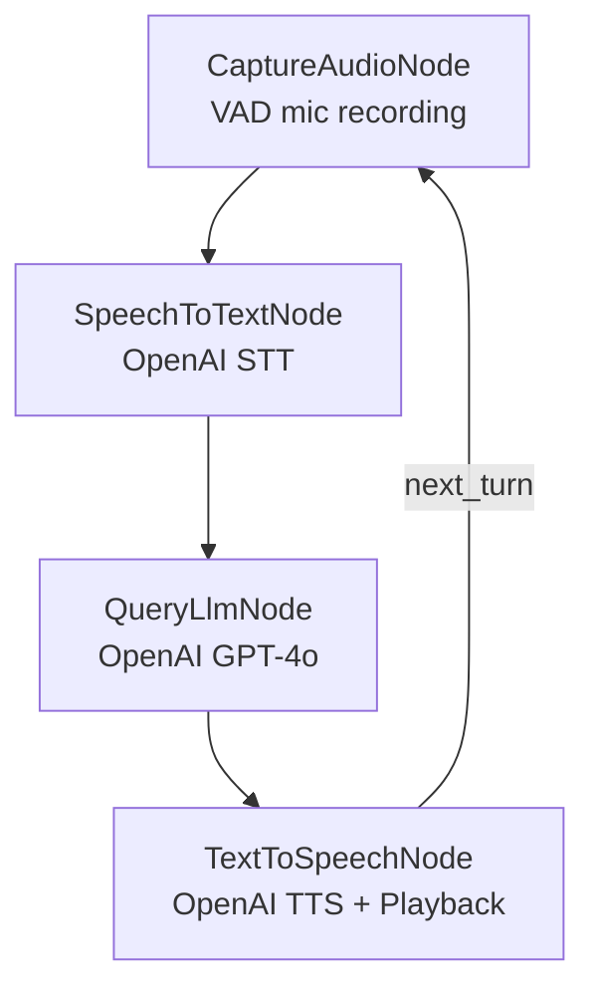

# PocketFlow Voice Chat (C#)

A voice-based interactive chat application built with **PocketFlow for .NET**. Speak your query and the assistant will respond with synthesised speech, maintaining full conversation history across turns.

## Features

- **Voice Activity Detection (VAD)** – starts recording when speech is detected, stops on silence (RMS-based, no extra library needed).
- **Speech-to-Text (STT)** – transcribes recorded audio with OpenAI `gpt-4o-transcribe`.
- **LLM Interaction** – generates responses with OpenAI `gpt-4o`, maintaining the full chat history.
- **Text-to-Speech (TTS)** – synthesises the reply with OpenAI `gpt-4o-mini-tts` (Alloy voice, WAV output).
- **Continuous Conversation** – loops automatically back to listen after each response.

## Prerequisites

| Requirement | Notes |
|---|---|
| .NET 10 SDK | `dotnet --version` |
| `libportaudio2` | Audio I/O on Linux – see below |
| OpenAI API key | Set `OPENAI_API_KEY` environment variable |

### Install PortAudio (Linux)

```bash
sudo apt-get update && sudo apt-get install -y libportaudio2
```

On macOS PortAudio is available via Homebrew: `brew install portaudio`.

## How to Run

```bash
# 1. Set your API key
export OPENAI_API_KEY="sk-..."

# 2. Restore packages & run
cd src/VoiceChat
dotnet run
```

Follow the console prompts. The application starts listening as soon as `Listening for your query...` appears.

## Project Structure

```
VoiceChat/
├── Program.cs            ← entry point (async top-level statements)
├── Flow.cs               ← assembles the AsyncFlow
├── Nodes.cs              ← CaptureAudioNode, SpeechToTextNode,
│                            QueryLlmNode, TextToSpeechNode
├── Utils/
│   ├── AudioUtils.cs     ← VAD recording, PCM playback, WAV encode/decode
│   ├── CallLlm.cs        ← OpenAI chat completions (gpt-4o)
│   ├── SpeechToText.cs   ← OpenAI audio transcription (gpt-4o-transcribe)
│   └── TextToSpeech.cs   ← OpenAI speech synthesis (gpt-4o-mini-tts)
└── VoiceChat.csproj
```

## How It Works



| Node | Responsibility |
|---|---|
| `CaptureAudioNode` | Reads 50 ms chunks from the microphone via **PortAudioSharp2**, applies RMS-based VAD to detect speech start and end, returns `float[]` PCM data. |
| `SpeechToTextNode` | Encodes the PCM data as a 16-bit WAV and sends it to OpenAI `gpt-4o-transcribe`. Adds the transcribed text to `chat_history`. |
| `QueryLlmNode` | Sends the full `chat_history` to `gpt-4o` and appends the assistant reply to history. |
| `TextToSpeechNode` | Requests WAV audio from `gpt-4o-mini-tts`, decodes it, and plays it back through **PortAudioSharp2**. Returns `"next_turn"` to loop. |

## Configuration

All API parameters are customisable via constants at the top of each utility class or by passing arguments directly. Key defaults:

| Parameter | Default |
|---|---|
| Sample rate | 44 100 Hz |
| Silence threshold (RMS) | 0.01 |
| Min silence to stop | 1 000 ms |
| Max recording duration | 15 s |
| LLM model | `gpt-4o` |
| STT model | `gpt-4o-transcribe` |
| TTS model | `gpt-4o-mini-tts` |
| TTS voice | `alloy` |

## NuGet Dependencies

| Package | Purpose |
|---|---|
| `OpenAI` 2.2.0 | Chat completions, STT, TTS |
| `PortAudioSharp2` 1.0.3 | Cross-platform microphone capture & speaker playback |

